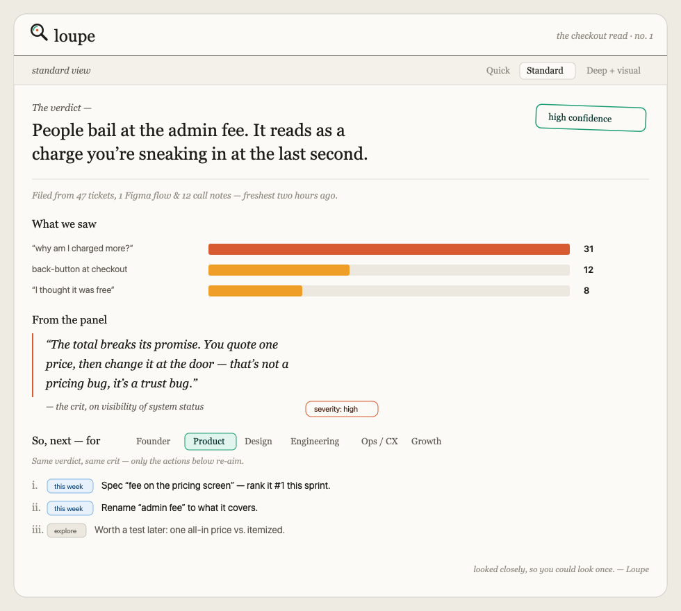
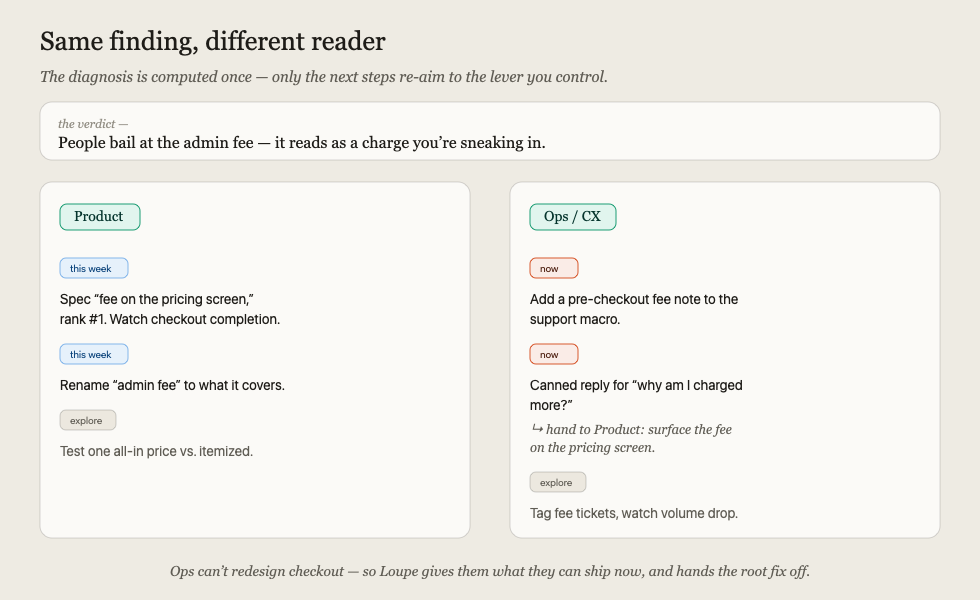
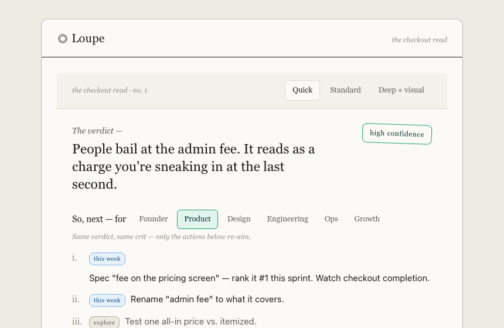
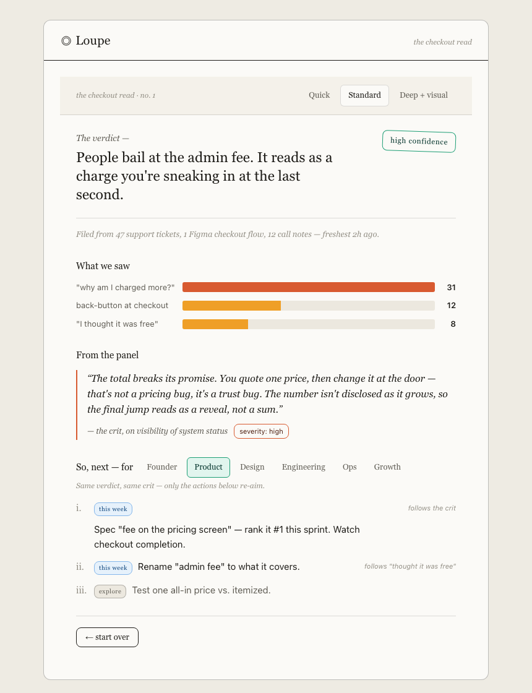
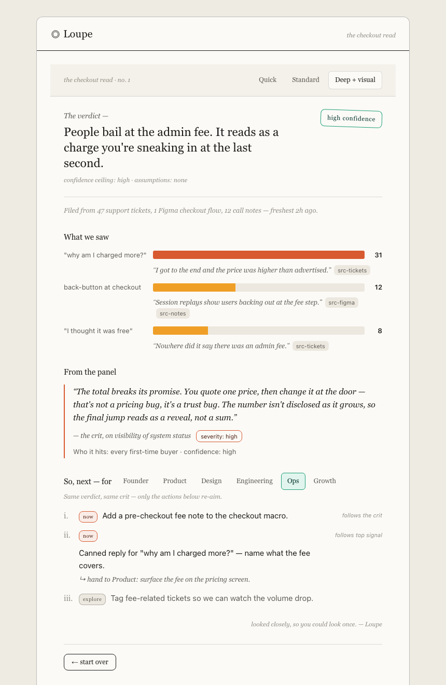

<p align="center">
  
</p>

<p align="center">
The design critic startups don't have time to convene.<br>
Throw in raw user research — tickets, Figma links, call notes — get back one clear, visual, opinionated report.
</p>

<p align="center">
  
  
  
</p>

<p align="center">
  
</p>

---

## What it does

Most teams have real user signal — a pile of support tickets, a Figma flow, some call notes — but no time to compile it and no senior designer to critique it. Loupe is the tool you throw that mess into. It returns a single report that reads top-to-bottom as **one argument**:

> **The Verdict** → **Signals** (what we saw) → **The Critique** (why it's broken) → **Next Steps** (what to do)

Every recommendation traces back through the critique, to a signal, to a raw source. No black box — you can verify the whole chain.

## Why it's different

- **It has an opinion.** The Verdict is a single, falsifiable sentence with a confidence signal — not a hedge, not a data dump.
- **It critiques, not just summarizes.** The differentiator is a critic *speaking* — naming the heuristic you violated, the trust you broke — the design crit you'd otherwise convene a room for.
- **It adapts to who's reading.** The same diagnosis becomes different actions for a founder, a PM, a designer, an engineer, ops, or growth — with an explicit hand-off when the fix isn't yours to make.
- **It stays honest.** Confidence is capped by how much context you gave it, and never claims certainty. A good critic finds the flaw — including in its own read.
- **It's cost-aware by design.** Links are read by reference, big exports are sampled not fully read, vision is opt-in. Nothing is processed until you run it.

## One engine, six readers

The diagnosis is computed **once**. Only the final pass re-aims the actions to the lever you actually control — and hands the root fix off when it isn't yours to make.

<p align="center">
  
</p>

## Three depths, one spine

Choose how much report you want. Same five-section argument, three resolutions — depth adds detail, never reorders the argument. *(Live screenshots of the running app.)*

<table>
<tr>
<td width="33%" valign="top"></td>
<td width="33%" valign="top"></td>
<td width="33%" valign="top"></td>
</tr>
<tr>
<td valign="top"><b>Quick</b><br>Verdict + next steps. The Slack-paste before standup.</td>
<td valign="top"><b>Standard</b><br>Adds inputs, signal bars, and the critique.</td>
<td valign="top"><b>Deep + visual</b><br>Adds per-signal quotes &amp; sources, who-it-hits, and the confidence ceiling.</td>
</tr>
</table>

## Quickstart

No dependencies — Python standard library only.

```bash
git clone git@github.com:YilannDong/loupe.git
cd loupe
python3 server.py
# open http://localhost:4317
```

Then, in the app:

1. **Describe what you need to see** — one messy sentence becomes the verdict's target.
2. **Hand it your material** — tap the sources you have (the intake guesses the rest and lets you correct it).
3. **Pick your role** — this shapes the next steps.
4. Hit **Look closer**, then switch **role** and **depth** on the report — watch the actions re-aim while the diagnosis holds.

## How it works

Five passes, mirroring the five-section report:

```
ingest → cluster → diagnose → conclude → translate
  │         │          │          │           │
 raw     Signals    Critiques   Verdict    Next Steps
 input              (+severity) (+confidence) (role-shaped)
```

The diagnosis is computed once; only `translate` is role-conditioned — which is why switching role is cheap. The pipeline, the `Report` data model, and its enforced invariants (no orphan recommendations; no claim exceeds the confidence ceiling) are documented in **[ENGINE.md](ENGINE.md)**. The product contract — the spine, the depth modes, the voice — is in **[PRD.md](PRD.md)**.

> **Status:** the engine ships with a worked example (the checkout drop-off study shown above) so it runs with zero secrets. The five Claude passes are stubbed and marked `# TODO` in [`engine/report.py`](engine/report.py) — that's the seam where the model gets wired in.

## Roadmap

- [ ] Wire the real Claude passes (cluster / diagnose / conclude / translate)
- [ ] Source adapters: CSV / Zendesk / Intercom ingest, Figma metadata by reference
- [ ] Export: shareable report link + PDF
- [ ] Persona drafting when none are provided (flagged as assumptions)

## Project layout

```
server.py          # stdlib dev server + /api/report endpoint
engine/report.py   # the 5-pass pipeline + Report data model (passes stubbed)
web/               # intake → report UI (no framework, no build step)
assets/            # logo + example renders
PRD.md             # product contract
ENGINE.md          # build spec
```

## License

MIT — see [LICENSE](LICENSE). Built by [Yilan D](https://github.com/YilannDong).
